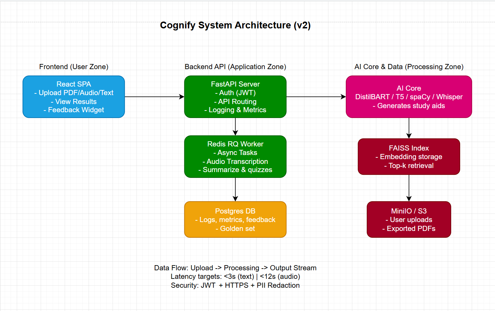

# Architecture v2 — Cognify
---

## 1. Overview

Cognify’s architecture evolved from a simple monolithic FastAPI app (Week 2) into a **modular three-layer system**:
- **Frontend (React SPA)** — handles user interactions and displays study results.
- **Backend API (FastAPI)** — orchestrates processing, handles uploads, and communicates with AI Core.
- **AI Worker (Core + Queue)** — runs heavy NLP tasks asynchronously through Redis RQ.

All communication between frontend and backend occurs via REST API calls secured by JWT authentication.  
The system is designed for **local development on free tiers** (Render + Vercel + MinIO/Postgres containers).

---

## 2. Components

| Layer | Component | Function | Technology | Notes |
|-------|------------|-----------|-------------|-------|
| **Frontend** | React (Vite + shadcn/ui) | User UI for upload, progress view, feedback | Node v18 / npm | Deployed on Vercel |
| **API Gateway** | FastAPI | Routes requests, validates JWT, logs metrics | Python 3.11 + Uvicorn | Stateless REST API |
| **Task Queue** | Redis RQ | Handles async jobs (audio → text, long summaries) | Redis 7.x | Ensures non-blocking UX |
| **AI Core** | Summarizer (DistilBART), Quiz (T5), Glossary (spaCy), Transcription (Whisper) | Runs NLP models | Hugging Face, OpenAI Embeddings | Local GPU optional |
| **Vector Store** | FAISS | Chunk index for retrieval and citation | text-embedding-3-small | < 300 ms search |
| **Database** | Postgres | Stores metrics, logs, feedback | psycopg + SQLAlchemy | Lightweight schema |
| **Object Storage** | MinIO / S3 | Stores uploads and exports | boto3 | Signed URLs for security |
| **Monitoring** | Grafana + Prometheus | Latency / cost dashboards | OpenTelemetry | Used for evaluation plan |

---

## 3. Data Flow

1. **User Upload** → Frontend sends PDF or audio to `/api/upload`.  
2. **API Store + Queue** → File saved to S3; job ID pushed to Redis.  
3. **Worker Process** → Extracts text or transcribes audio; chunks data; stores embeddings in FAISS.  
4. **User Requests Study Aid** → `/api/generate` with job ID and mode (summary / quiz / glossary).  
5. **Retrieval Phase** → AI Core pulls top-k chunks (FAISS) and calls LLM (local or API).  
6. **Generation Phase** → Outputs text with citations + metadata (JSON).  
7. **Response Stream** → Backend streams tokens to Frontend for instant feedback.  
8. **Storage** → Results and metrics logged to Postgres and S3.  
9. **Feedback Loop** → User sends 👍/👎 feedback → updates evaluation tables.

---

## 4. Latency Budget Annotations

| Stage | Target (ms / s) | Notes |
|--------|-----------------|-------|
| File Upload | < 2000 ms | Browser → S3 signed upload |
| Text Extraction / Transcription | < 6000 ms | Redis Worker process |
| Embedding & Search | < 300 ms | FAISS index lookup |
| Generation (LLM call) | < 2000 ms | DistilBART local / GPT-4o-mini remote |
| Stream Delivery | < 500 ms | Server-sent events to UI |
| Total End-to-End Goal | < 3 s (text) / < 12 s (audio) | Meets Week 6 targets |

---

## 5. Security Boundaries

- **JWT Auth:** verifies session token per request.  
- **S3 Signed URLs:** ensure temporary access to uploads.  
- **HTTPS Everywhere:** all traffic encrypted.  
- **PII Redaction:** spaCy NER module removes emails, phones from logs.  
- **Internal Network:** Redis + Postgres behind private Docker bridge.  

---

## 6. Failure Points & Recovery Plan

| Risk | Handling |
|------|-----------|
| LLM API timeout | Auto-retry × 3 + fallback to cached summary |
| Redis job crash | Dead-letter queue + alert |
| PDF parser error | Skip faulty page + partial result response |
| Storage outage | Local temp cache until reconnected |
| Frontend disconnect | Resume stream on reconnect |

---

## 7. Evolution Since Week 2

| Change | Reason |
|--------|--------|
| Split backend into API + worker | Avoid blocking I/O from long LLM tasks |
| Introduced Redis queue | Handle audio and multi-page jobs asynchronously |
| Added FAISS index | Enables retrieval-augmented generation |
| Added Postgres metrics DB | Required for evaluation and cost tracking |
| Added Grafana dashboard | Support for Evaluation Plan metrics |
| Added caching layer | Reduce token costs and latency |

---

## 8. Technology Stack Versions

| Component | Version |
|------------|----------|
| FastAPI | 0.115+ |
| Python | 3.11 |
| React | 18.3 |
| Node | 18 LTS |
| Redis RQ | 1.15 |
| Postgres | 16 |
| FAISS | 1.8 |
| Hugging Face Transformers | 4.46 |
| spaCy | 3.7 |
| Whisper | base.en (2024) |
| OpenAI API (optional) | GPT-4o-mini / text-embedding-3-small |

---

## 9. Deployment Diagram

_See `architecture-explanation.md` for element descriptions._

---

**Prepared by:** Syntax Syndicate · Team Cognify
