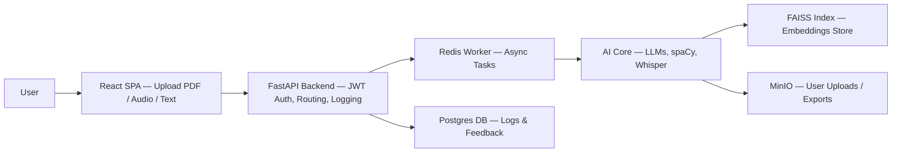

# Cognify — Project Requirements Document (PRD)
_Last updated: November 7 2025_

---

## 1. Project Goal & Core Problem

**Goal:**  
Cognify helps students and professionals rapidly study long materials (PDFs, audio lectures, transcripts) by generating concise summaries, quizzes, and glossaries using AI.

**Core Problem:**  
Learners waste hours reading dense content or watching long lectures. Existing AI summarizers are generic, lose structure, and lack interactivity. Cognify aims to provide domain-aware, citation-linked study aids that improve retention and reduce review time by > 60 %.

---

## 2. MVP Scope & Key Features

| Category | Feature | MVP | Later |
|-----------|----------|-----|-------|
| Input | Upload PDF / audio / plain text | ✅ |  |
| Processing | Auto summary generation | ✅ |  |
| Processing | Quiz question generation | ✅ |  |
| Processing | Glossary extraction | ✅ |  |
| Output | Download/export summary as PDF | ✅ |  |
| Feedback | User rating + comment system |  | ✅ |
| Collaboration | Share study packs |  | ✅ |

MVP target: functional pipeline from upload → summary + quiz + glossary → downloadable output.

---

## 3. Target Audience

- **Primary:** University students, self-learners, and researchers processing lecture materials.  
- **Secondary:** Professionals needing document briefings (legal, medical, tech).  
- **Pain points:** Long content, short study time, inconsistent note quality.

---

## 4. Technology Stack (with versions)

| Category | Technology | Version | Notes |
|-----------|-------------|----------|-------|
| Language | Python | 3.11.4 | Backend & AI processing |
| Framework | FastAPI | 0.104.1 | Async API |
| Frontend | React | 18.2.0 | Vite build tool |
| Database | PostgreSQL | 15.3 | Hosted via Supabase |
| Cache/Queue | Redis RQ | 5.0.1 | Background tasks |
| Vector Index | FAISS | 1.8.0 | Local embedding search |
| LLM API | OpenAI GPT-4o / GPT-4o-mini | 1.3.5 | Text generation |
| Embedding Model | text-embedding-3-small |  | Cost-efficient embeddings |
| Storage | MinIO / S3 | 2025.10 | File storage |
| Auth | JWT | 2.8.0 | Secure user sessions |

---

## 5. High-Level Architecture



**Latency targets:**  
- Text summarization < 3 s  
- Audio transcription < 12 s  

**Security:** JWT + HTTPS + PII Redaction.

---

## 6. Core Components / Modules

1. **Frontend:** React SPA for file upload, progress, and results view.  
2. **Backend API:** FastAPI app exposing `/upload`, `/summary`, `/quiz`, `/glossary`.  
3. **Async Worker:** Redis RQ handles heavy tasks (transcription, embeddings).  
4. **AI Core:** Orchestrates LLM prompts, embeddings, summarization models.  
5. **Database:** Logs, metrics, user feedback, golden-set test data.  
6. **Vector Store:** FAISS for efficient semantic retrieval.  
7. **Storage:** MinIO (S3 compatible) for user files and exports.

---

## 7. Key UI / UX Considerations

- One-screen upload → results flow (no clutter).  
- Real-time progress indicator during processing.  
- Downloadable study pack (summary + quiz + glossary).  
- Light/dark theme for accessibility.  
- Clear attribution and citation labels for transparency.  

---

## 8. Coding Standards & Quality Criteria

- **Python:** PEP 8 + Black + Ruff  
- **JavaScript:** Airbnb Style Guide + Prettier + ESLint  
- **Testing coverage:** ≥ 80 %  
- **Quality pillars:** Reliability | Security | Maintainability | Testability | Cost-Efficiency  

---

## 9. Testing Strategy

| Test Type | Tool | Target |
|------------|------|---------|
| Unit | pytest | API endpoints, functions |
| Integration | Postman | End-to-end upload→output |
| Regression | PyTest + GitHub Actions | Weekly run |
| User Testing | Manual | 5 participants (Week 7) |
| Evaluation Golden Set | Automated | Accuracy ≥ 85 %, Latency < 3 s |

---

## 10. Initial Setup Steps

```bash
git clone https://github.com/yourusername/cognify
cd cognify
cp .env.example .env
# Fill in your OpenAI API Key and DB URL
python -m venv .venv
source .venv/bin/activate
pip install -r requirements.txt
npm install --prefix frontend
uvicorn app.main:app --reload
```

---

## 11. Key Architectural Decisions

| Decision | Justification |
|-----------|----------------|
| **FastAPI + Redis** | Async tasks avoid API blocking during LLM calls |
| **FAISS local index** | Free and high-performance for MVP scale |
| **OpenAI models** | Strong summarization and quiz generation |
| **MinIO over AWS S3** | Local dev-friendly and no cost |
| **Postgres** | Relational data suits logging and feedback tables |

---

## 12. Project Documentation

- `/docs/week-4/` → Design Review materials  
- `/docs/week-5/` → PRD and Technical Specs  
- `/README.md` → Quick start + links  
- `/api_docs` (auto-generated via FastAPI / OpenAPI)  

---

## 13. Repository Link

👉 [GitHub – Cognify Repo](https://github.com/BEKATX/SYNTAX_SYNDICATE)

---

## 14. Dependencies & Third-Party Services

- OpenAI API (GPT-4o, Embeddings)  
- Supabase (Postgres hosting)  
- Render / Vercel (for deployment)  
- GitHub Actions (CI/CD)  
- spaCy for NER / tokenization  
- PyPDF2 and Whisper for file/audio ingestion  

---

## 15. Security Considerations

- JWT-based Auth + role scopes  
- HTTPS only traffic  
- PII redaction before LLM calls  
- Input sanitization and rate limits  
- Secrets in `.env`, never in code  
- Regular dependency vulnerability scan (Ruff, Snyk)

---

## 16. Performance Requirements

| Metric | Target |
|---------|---------|
| P95 API Latency | < 500 ms (backend) |
| Summarization Latency | < 3 s (text)  /  < 12 s (audio) |
| Uptime | ≥ 99 % |
| Token cost per query | ≤ $0.05 |
| Vector search latency | < 300 ms |

---

## 17. Monitoring & Observability

- **Metrics:** Request count, response time, token usage.  
- **Tools:** Prometheus + Grafana (local) / PostHog (for UI analytics).  
- **Logs:** Structured JSON logs in Postgres.  
- **Alerts:** Email alerts for task failures via FastAPI middleware.

---

## 18. Deployment & DevOps

- **Dev Environment:** Local Docker Compose (services: FastAPI, Redis, Postgres, MinIO).  
- **Staging / Prod:** Render or Vercel for backend + frontend.  
- **CI/CD:** GitHub Actions → pytest → lint → deploy.  
- **Versioning:** Semantic ( v1.0.0 initial MVP ).  
- **Backups:** Daily Postgres dump + MinIO sync.  

---

**End of Document**
